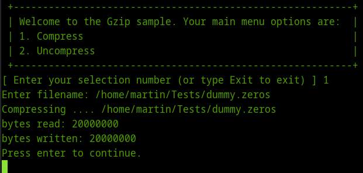

# Compresión y descompresión de flujos(streams) en .NET
		

Una capacidad muy útil en cualquier Framework es la  de comprimir y descomprimir archivos o flujos de datos,  ejemplos aplicados de esta capacidad los tenemos en las aplicaciones que intercambian datos a través de la red como el caso de comprimir el <a href="http://msdn.microsoft.com/es-es/library/system.web.ui.control.viewstate%28v=vs.110%29.aspx">viewstate</a> en las peticiones y respuestas del servidor al cliente en una aplicación ASP.NET o si necesitamos reducir el tamaño de los objetos JSON  que viajan de una aplicación hacia un servicio web y viceversa.

.NET proporciona las clases <a href="http://msdn.microsoft.com/en-us/library/system.io.compression.gzipstream.aspx">GzipStream</a> y <a href="http://msdn.microsoft.com/es-es/library/system.io.compression.deflatestream%28v=vs.110%29.aspx">DeflatStream</a> que implementan el algoritmo de compresión estándar gzip que está libre de patente. De hecho la diferencia entre ambas clases es que la clase <b>GzipStream</b> utiliza la especificación <i>gzip</i> descrita en el <a href="http://www.ietf.org/rfc/rfc1952.txt">RFC</a> 1952 que reduce el tamaño de los datos utilizando un código Lempel-Ziv (LZ77) con un CRC de 32 bits, lo que significa que se puede incluir encabezados (headers) con información extra que puede ser utilizada por cualquier herramienta de descompresión o por el comando gunzip de Linux o UNIX.

En resumen si los datos comprimidos van a hacer descomprimidos por una aplicación .NET lo recomendable es usar la clase <b>DeflatStream</b>, de lo contrario si van a hacer descomprimidos por otra aplicación usar la clase <b>GzipStream</b>.

Para mostrar la utilización de la clase <b>DeflatStream</b>  escribí el siguiente programa que ejecuta la acción de comprimir o descomprimir dependiendo de la extensión del archivo que le pasemos como parámetro. (Este código sirve para ambos flujos solo hay que reemplazar  <b>DeflatStream</b> por <b>GzipStream</b>)

Ahora para probar el código, voy a crear un archivo llamado <i>dummy.zeros</i> con un tamaño de 20 megas para pasárselo como parámetro al programa.

Este archivo lo creo con el comando <b>dd</b> en Linux

<pre>
dd if=/dev/zero of=dummy.zeros bs=1000 count=20000
</pre>

 

Ahora muestro el tamaño del archivo <i>dummy.zeros</i>, siendo de 20Mb.

 

Ahora comprimo el archivo dummy.zeros con el programa  de ejemplo, esto lo hago utilizando las opciones del menu:

 

 

 

Si se ejecuta correctamente este programa debe crear un archivo llamado <i>dummy.zeros.gz</i>, el cual es el archivo comprimido de <i>dummy.zeros</i>. Comparamos el tamaño de ambos archivos.

 

Ahora voy a descomprimir el archivo <i>dummy.zeros.gz</i>. Ejecutamos nuevamente el programa utilizando la opcion 2 y pasandole el nombre del archivo.

 

Bien ahora con todos los archivos, podemos comparar sus tamaños y comprobar que las clases de compresión de .NET funcionaron.

 

Para diseñar programas que utilicen las clases de compresión y descompresión de archivos en C#, el primer paso es crear los flujos de entrada y de salida.

<pre>
FileStream inputStream = new FileStream (filename , FileMode.Open, FileAccess.Read);
FileStream outputStream = new FileStream (destFile , FileMode.Create, FileAccess.Write))
</pre>

En el caso de la compresión el flujo de compresión <b>(DeflateStream)</b> debe de envolver al flujo de salida, porque la entrada es un archivo sin comprimir que tendrá como destino un archivo comprimido.

<pre>
DeflateStream zipStream = new DeflateStream (outputStream, CompressionMode.Compress)
</pre>

Para la descompresión el flujo de compresión <b>(DeflateStream)</b> deberá de envolver al flujo de entrada ya que es un archivo comprimido que tendrá como destino un archivo sin comprimir.

<pre>
DeflateStream zipStream = new DeflateStream (inputStream, CompressionMode.Decompress)
</pre>

Hay que recordar que  uno de los factores que degradan el desempeño de las aplicaciones ASP.NET es cuando existe un cuello de botella en el ancho de banda y no en la utilización del procesador, en el caso de la compresión de datos usada junto con el protocolo HTTP se recomienda  para texto: JSON, XML, HTML, etc. Esta compresión no es útil para archivos de imágenes, los cuales ya se encuentran comprimidos.

